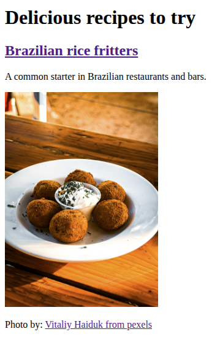
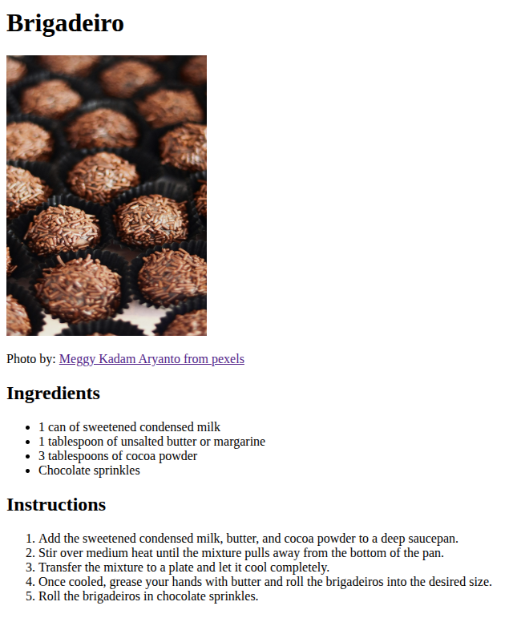

# My First Project

## Description
A website presenting three delicious and very popular Brazilian recipes.  
The home page displays the name, image, and a brief description of each dish.  
Both the headings and images link to the full recipe page of the chosen dish.

## Project goals
Practice basic HTML and Git/GitHub by applying concepts learned in the curriculum.

## Learnings
- Basic HTML structure and syntax.
- File directory organization.
- Basic Git/GitHub usage.

## How to Use
1. Clone the repository.
2. Open the `index.html` in your web browser.
 
## Technologies Used
- HTML
- Git

## Screenshots

## Image Credits
Images from [pexels](https://www.pexels.com/): [Brazilian rice fritters](https://www.pexels.com/pt-br/foto/delicioso-arancini-frito-com-molho-cremoso-29286763/), [Breaded Chicken](https://www.pexels.com/pt-br/foto/comida-alimento-refeicao-placa-17086343/) and [Brigadeiro](https://www.pexels.com/pt-br/foto/comida-alimento-refeicao-sombrio-7428532/).

## References
Recipes adapted from the following sources:
- Brazilian rice fritters: [Tudo Gostoso](https://www.tudogostoso.com.br/receita/4224-bolinho-de-arroz.html), [Sabores Ajinomoto](https://www.saboresajinomoto.com.br/receita/bolinho-de-arroz) and [Panelinha](https://panelinha.com.br/receita/bolinho-de-arroz-airfryer).
- Breaded Chicken: [Tudo Gostoso](https://www.tudogostoso.com.br/receita/30068-file-de-frango-empanado.html) and [Sabores Ajinomoto](https://www.saboresajinomoto.com.br/receita/frango-a-milanesa).
- Brigadeiro: [Tudo Gostoso](https://www.tudogostoso.com.br/receita/114-brigadeiro.html).